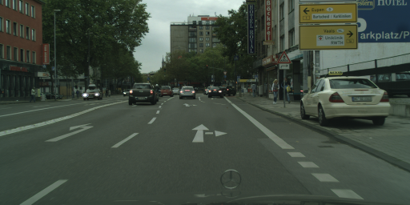
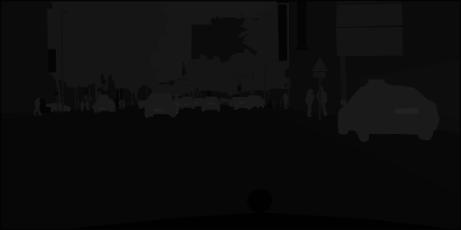
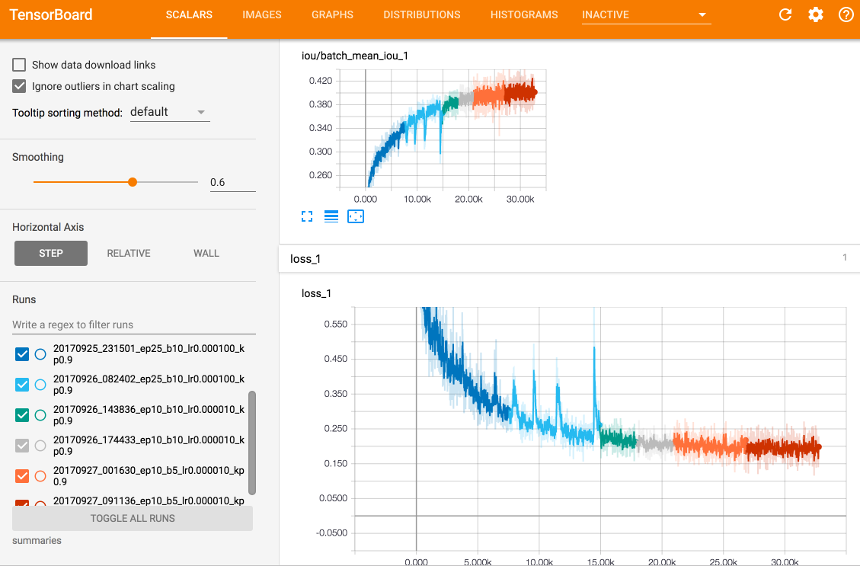
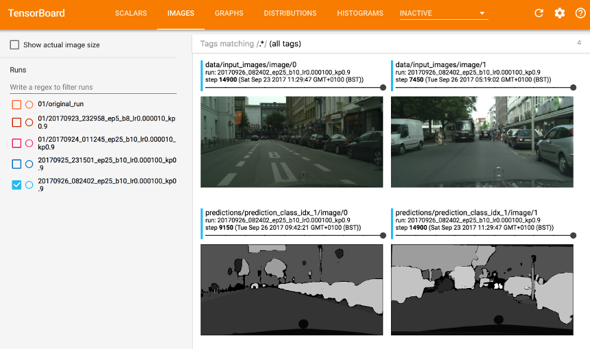

# Semantic Segmentation using Fully Convolutional Networks

## Introduction
In this project, we demonstrate one of the approaches to semantic
scene understanding in the problem domain of self-driving car perception.

At the moment there are two state of the art approaches, both using convolutional
neural networks. One is based on
detecting bounding boxes around objects of interest (like YOLO and SSD) and
classifying them. The other approach is semantic segmentation using
Fully Convolutional Network (FCN) where each pixel
of an image is classified into one of the relevant classes like 'driveable road space',
'other vehicles', 'pedestrians', 'buildings' etc.

Bounding box detector approach is faster, but does not give quite as valuable
answers. For example: how would you draw a bounding box around driveable road space?
The FCN approach is slower, but gives quite precise regions of interest
in segmented image to be used directly in perception/planning pipelines of
an autonomous vehicle.

In this work we implement FCN approach using [paper by Shelhamer, Long
and Darrell](https://arxiv.org/pdf/1605.06211.pdf).
Their code can be found [here](https://github.com/shelhamer/fcn.berkeleyvision.org)

## Data Set: Cityscapes

Good labeled datasets are vital to success of supervised learning tasks.
For the task at hand we chose [Cityscapes dataset](https://www.cityscapes-dataset.com)
which provides detailed labeled examples of road scene images
from 50 German cities, across all seasons, just daytime in moderate/good
weather conditions. It has fine ground truth labels for 35 classes of
various classes of objects
in the scene relevant for tasks of autonomous vehicle perception.

The data need to be downloaded. In this work we use
gtFine_trainvaltest.zip (241MB) and leftImg8bit_trainvaltest.zip (11GB)
files.
The
[provided code](https://github.com/mcordts/cityscapesScripts) was used to
pre-process the data.
In particular we have changed `helpers/labels.py` to use all labelled classes
(`cityscape_labels.py` in this repo is same version of code.)
And we have run `preparation/createTrainIdLabelImgs.py` to generate
ground truth images for updated labels.

Our final cityscapes data tree looks like this:
```
cityscapes
├── README.md
├── cityscapesscripts
│   ├── __init__.py
│   ├── annotation
│   │   ├── cityscapesLabelTool.py
...
│   ├── evaluation
│   │   ├── __init__.py
...
│   ├── helpers
│   │   ├── __init__.py
...
│   │   └── labels.py
│   ├── preparation
│   │   ├── __init__.py
..
│   │   ├── createTrainIdLabelImgs.py
│   │   └── json2labelImg.py
│   └── viewer
...
│           └── zoom.png
├── data
│   ├── README
│   ├── gtFine
│   │   ├── test
│   │   │   ├── berlin
│   │   │   │   ├── berlin_000000_000019_gtFine_color.png
│   │   │   │   ├── berlin_000000_000019_gtFine_instanceIds.png
│   │   │   │   ├── berlin_000000_000019_gtFine_labelIds.png
│   │   │   │   ├── berlin_000000_000019_gtFine_labelTrainIds.png
...
│   │           ├── munster_000173_000019_gtFine_color.png
│   │           ├── munster_000173_000019_gtFine_instanceIds.png
│   │           ├── munster_000173_000019_gtFine_labelIds.png
│   │           └── munster_000173_000019_gtFine_polygons.json
│   ├── leftImg8bit
│   │   ├── test
│   │   │   ├── berlin
│   │   │   │   ├── berlin_000000_000019_leftImg8bit.png
...
│   │           └── munster_000173_000019_leftImg8bit.png
│   └── license.txt
```

We use 2975 labeled images for training:
```
$ find cityscapes/data/gtFine/train -type f -name '*gtFine*labelTrainIds.png'  | wc -l
    2975
```

Here is an example of original image and image with labels (as they use pixel
intensities from 0 to 34 out of the range of 0..255 you really need to look
hard to see the labels):






## Setup

We use [Python 3](https://www.python.org/), [anadonda distribution](https://docs.anaconda.com/anaconda/install.html)

Provided [requirements.txt](requirements.txt) lists the used packages.

The implementation is in pure tensorflow.
We recommend [building tensorflow from sources](https://www.tensorflow.org/install/install_sources)
to fully utilise your hardware capabilities.
In this work we used tensorflow 1.3


## Implementation Notes

[fcn8vgg16.py](fcn8vgg16.py) is the definition of network architecture (as per paper above).
It is using [VGG16](https://arxiv.org/abs/1409.1556) architecture for encoder part of the network.
We use pre-trained VGG16 weights provided by Udacity for initialization before training.
The download happens automatically first time you run training.

[main.py](main.py) is the driving script. It takes most of the inputs from command
line arguments.


## How to Run

If run without arguments the `main.py` lists the list of options it takes:
```
$ python main.py
usage: main.py [-h] [-g GPU] [-gm GPU_MEM] [-x {1,2}] [-ep EPOCHS]
               [-bs BATCH_SIZE] [-lr LEARNING_RATE] [-kp KEEP_PROB]
               [-rd RUNS_DIR] [-cd CKPT_DIR] [-sd SUMMARY_DIR] [-md MODEL_DIR]
               [-fd FROZEN_MODEL_DIR] [-od OPTIMISED_MODEL_DIR]
               [-ip IMAGES_PATHS] [-lp LABELS_PATHS] [-vi VIDEO_FILE_IN]
               [-vo VIDEO_FILE_OUT]
               {train,predict,freeze,optimise,video}
```

`--gpu=1` enables use of GPU for training/inference (0 is for CPU-only run)

`--xla=level` enables use of [XLA](https://www.tensorflow.org/performance/xla/)

`--epochs=10` sets the number of training epochs

`--batch_size=5` sets the training mini-batch size. For FCNs every pixel of the
image is classified, so empirically batch size should be relatively small. We
experimented with batch sizes between 5 and 10. Also be mindful of the size of the
network -- you may need at least 8Gb+ of GPU memory to run the training.

`--learning_rate=0.0001` sets the training learning rate

Provided scripts `nn_xxxxx.sh` demonstrate how to call `main.py` for all possible actions, which we detail below.


### Training

To train the network (includes download of pre-trained VGG16) run:

```
python main.py train --gpu=1 --xla=2 -ep=10 -bs=10 -lr=0.00001
```

Here is an example of its output:
```
2017-09-27 09:11:22.365928: I tensorflow/stream_executor/cuda/cuda_gpu_executor.cc:893] successful NUMA node read from SysFS had negative value (-1), but there must be at least one NUMA node, so returning NUMA node zero
2017-09-27 09:11:22.366200: I tensorflow/core/common_runtime/gpu/gpu_device.cc:955] Found device 0 with properties:
name: GeForce GTX 1080 Ti
major: 6 minor: 1 memoryClockRate (GHz) 1.582
pciBusID 0000:01:00.0
Total memory: 10.91GiB
Free memory: 10.40GiB
2017-09-27 09:11:22.366213: I tensorflow/core/common_runtime/gpu/gpu_device.cc:976] DMA: 0
2017-09-27 09:11:22.366217: I tensorflow/core/common_runtime/gpu/gpu_device.cc:986] 0:   Y
2017-09-27 09:11:22.366223: I tensorflow/core/common_runtime/gpu/gpu_device.cc:1045] Creating TensorFlow device (/gpu:0) -> (device: 0, name: GeForce GTX 1080 Ti, pci bus id: 0000:01:00.0)
2017-09-27 09:11:22.413727: I tensorflow/core/common_runtime/gpu/gpu_device.cc:1045] Creating TensorFlow device (/gpu:0) -> (device: 0, name: GeForce GTX 1080 Ti, pci bus id: 0000:01:00.0)
2017-09-27 09:11:22.414399: I tensorflow/core/common_runtime/gpu/gpu_device.cc:1045] Creating TensorFlow device (/gpu:0) -> (device: 0, name: GeForce GTX 1080 Ti, pci bus id: 0000:01:00.0)
INFO:tensorflow:Restoring parameters from b'pretrained_vgg/vgg/variables/variables'
2017-09-27 09:11:29.055226: I tensorflow/core/common_runtime/gpu/gpu_device.cc:1045] Creating TensorFlow device (/gpu:0) -> (device: 0, name: GeForce GTX 1080 Ti, pci bus id: 0000:01:00.0)
INFO:tensorflow:Restoring parameters from ckpt/fcn8vgg16-26810
Train Epoch  1/10 (loss 0.195):   1%|          | 7/595 [00:13<18:20,  1.87s/batches]
...
INFO:tensorflow:No assets to save.
INFO:tensorflow:No assets to write.
INFO:tensorflow:SavedModel written to: b'runs/20170927_091136/model/saved_model.pb'
TensorFlow Version: 1.3.0
Default GPU Device: /gpu:0
action=train
gpu=1
keep_prob=0.9
images_paths=../cityscapes/data/leftImg8bit/train/*/*_leftImg8bit.png
batch_size=5
epochs=10
learning_rate=1e-05
restored from checkpoint ckpt/fcn8vgg16-26810
continuing training after 26810 steps done previously
saving trained model to runs/20170927_091136/model
```

The checkpoints are saved to `--ckpt_dir` which defaults to `ckpt`

The summaries are saved to `--summaries_dir` which defaults to `summaries`
You can see training visually by starting [tensorboard](https://www.tensorflow.org/get_started/summaries_and_tensorboard)

```
$ tensorboard --logdir summaries --host 0.0.0.0 --port 8080
```

If you then open tensorboard address `http://192.168.0.1:8080/` in your web browser
you will see
the graph visualisation and training statistics like the following:



Here we trained for 90 epochs in 6 runs, first run was for 25 epochs with learning
rate of 0.0001. Second run has same learning rate, which was too high as we see
volatility in convergence. For remaining runs we used learning rate of 0.00001.
The optimizer goal is cross-entropy loss.

We also measured mean [Intersection over Union, IoU](https://en.wikipedia.org/wiki/Jaccard_index)
metric. On average, across all 35 classes, it is about 40%.
But it is not weighted. Classes in Cityscapes dataset are not balanced.
For example there are much less traffic signs pixels than that of road surface or
sky. One way to improve accuracy (and training convergence) is to weigh
both loss (we use standard
[mean cross entropy loss](https://en.wikipedia.org/wiki/Cross_entropy#Cross-entropy_error_function_and_logistic_regression))
and IoU with weights
inversely proportional to how classes are represented.

Tensorboard also allows to see the input images alongside with visualised
class predictions (here we rescale pixel intensities to 0..255 so it is easier
to see what is going on):




## TODO
* look at ways to avoid `map_fn` for image normalisation in tensorflow graph.
it breaks optimised graph if we want to use `remove_nodes(op=Identity, op=CheckNumerics)`
and `quantize_nodes` optimization
* use weighted loss and IoU in inverse proportion to number class examples
